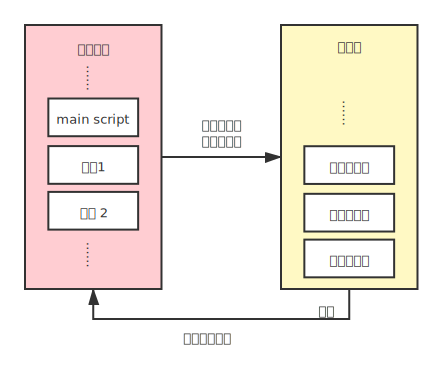
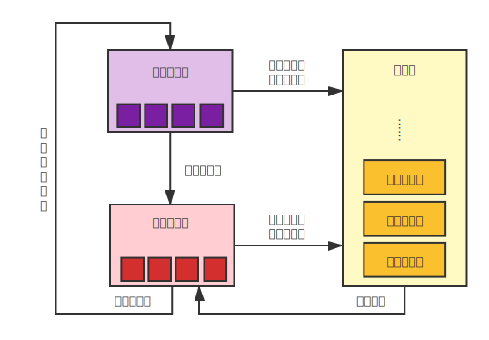
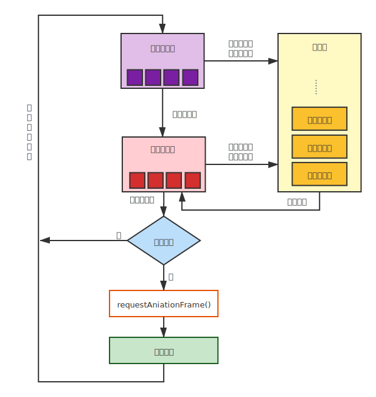

# 简单解释 Javascript 事件循环(Event Loop)

**[[Guide]]:** 阅读本文需要理解Javascript基本语法，以及同步和异步的概念。本文只介绍浏览器环境下的事件循环，因此不需要Node相关的知识。全文比较长，而且涉及的知识点有些多，希望耐心阅读。

[TOC]

## 0. 热身 - 一个简单的小例子

首先，来考虑如下代码：

```js
button.addEventListener("click", () => {
  console.log("click 1");
  setTimeout(() => {
    console.log("timeout 1");
  });
  new Promise((resolve) => {
    console.log("promise 1 create");
    resolve(null);
  }).then(() => {
    console.log("promise 1 fulfilled");
  });
});

button.addEventListener("click", () => {
  console.log("click 2");
  setTimeout(() => {
    console.log("timeout 2");
  });
  new Promise((resolve) => {
    console.log("promise 2 create");
    resolve(null);
  }).then(() => {
    console.log("promise 2 fulfilled");
  });
});
```

如果点击button，输出会是什么？

如果通过

```js
button.click();
```

这样一个函数，来激活上面的两个事件，输出又会是什么？

你可以先简单的思考一下，答案就在下面。

第一个的输出（直接点击button）是长成这样的：

```js
// click 1
// promise 1 create
// promise 1 fulfilled
// click 2
// promise 2 create
// promise 2 fulfilled
// timeout 1
// timeout 2
```

第二个的输出（用`button.click()`）是长成这样的：

```js
// click 1
// promise 1 create
// click 2
// promise 2 create
// promise 1 fulfilled
// promise 2 fulfilled
// timeout 1
// timeout 2
```

什么？这两个操作的输出竟然是不一样的！

如果不能解释上面的现象，可能是我们没有理解 Js 的事件循环模型，本文将帮你理解Js中这个看似奇怪的问题。这个例子的解释将会在最后。

## 1. 什么是事件循环(Event Loop)？为什么我们需要它？

### 1.1 单线程的Javascript

Javascript其实是单线程的，这是为了防止有多个函数同时对同一个元素修改所造成的race-condition。浏览器需要同时处理用户交互、脚本程序、网页渲染网络资源等等内容。如果用多个线程，我们不妨假设这样一种情景：

> 处理用户交互的线程说，要输入文本，处理脚本脚本程序的线程说说要删掉文本，那么浏览器该听谁的?

这样最后的结果是不确定的，而且很有可能出现错误。

为了避免这种复杂的情况，Javascript使用单一主线程(Main thread)来处理各种请求，将不同的操作分割成许多小的任务，每次只执行一个任务，并且在合适的时候暂停渲染页面(Rendering)。

不过注意，这并不是说Javascript没有多线程运算的能力，Js可以通过Worker创建新的线程来进行运算，但最后的结果仍然要发送回主线程，由主线程进行协调和执行。同样，异步编程也是在主线程外创建了其他的子线程，等待运算返回时，再由主线程进行协调工作。

### 1.2 阻塞代码

好吧，那么只有单线程，是怎么同时处理这么多交互的呢？比如说，在一个放着gif的网页上，浏览器是怎么做到一边更新gif，一边同时处理用户的滚动、输入、点击等等操作的呢？

这就是事件循环的用处了。事件循环的工作模式，可以这么理解：浏览器不断委托工作，把工作放进一个待办事项表，主线程不断处理这个待办事项表上的工作内容。在MDN上，有这样一个[解释](https://developer.mozilla.org/en-US/docs/Web/JavaScript/EventLoop)，消息循环就像是这样的：

```js
while (queue.waitForMessage()) {
  queue.processNextMessage()
}
```

在用户与浏览器发生交互时，主线程并不是立刻去处理用户的交互，而是把用户交互这个任务放进任务队列(Job queue)。而同时，更新gif的渲染也按照一定的间隔被放入队列，这样只要主线程处理的足够迅速，在两次网页渲染的间隔内，做完了所有运算，那么给人的感受就是同时处理了全部的交互。

那么如果处理得不够迅速呢？单线程的劣势也就在这里了。如果处理的任务的运算耗时太长，那么对网页的更新就会延后，对用户互动产生的事件的响应也会不及时。给人的感觉就像是：掉帧了，变卡了。

同时Js还有另外一个特性：总是处理完当前的任务以后，才会去处理下一个任务。在这样的特性下，Js的主线程是可以被阻塞的。不妨随便找一个gif然后试验一下如下的代码：

```html
<p>
  
</p>
<button onclick="while (true);">
  infinit loop
</button>
```

理想情况下，在按下按钮的一瞬间，gif的更新会停止，用户的其他交互也会停止。（chrome似乎仍然可以更新gif，但其他的事件会被阻塞。如果发生这种情况，请换成firefox进行试验。）这是因为，按下按钮时，会将一个无限循环的任务加入任务队列，主线程永远无法完成这个任务，因而在这个任务之后加入的交互任务、渲染任务都不会被处理。

### 1.3 总结 - 事件循环的妙处

Js为了防止多线程同时修改网页时所造成的race-condition和一些其他复杂的情况，使用了单线程的模型。

可以这么说，事件循环让Js能以单线程的模式，协调处理用户交互、网页脚本、页面渲染、网络请求的等操作，而不用处理多线程所带来的麻烦。

但同时也要注意，事件循环有一定要完成当前任务才会处理之后的任务的特性。如果单个任务运算太多、耗费时间太长，是会影响对网页渲染和之后的用户交互的处理，甚至阻塞主线程的。

## 2. 事件循环的组成部分

### 2.1 执行栈(execution stack)和任务队列(job queue)

#### 2.1.1 执行栈

首先我们需要理解执行栈的概念。在Js里，所有函数的执行都是在栈上进行的。每次函数调用，会在栈上创建一个局部上下文(local context)，当函数返回后，这个上下文就会出栈。script本身也会创建一个执行上下文，开始执行script时，会现在栈底创建一个全局上下文(global context)，等到整个script运行完毕，这个全局上下文就会弹出。局部上下文和全局上下文都是函数执行上下文(execution context)。同时，我们还要求，在开始执行Js的代码之前，执行栈一定是空的。

我们用下面的例子（非常简单，已经理解的可以跳过），来说明这个过程：

```js
function Square(n){
  return n * n;
}

function PrintSquare(n){
  let square = Square(n);
  console.log(square);
}

PrintSquare(4);
```

这个简单的代码片段在执行时，栈上经历了下面变化：

初始化：栈空。

+ 执行script，创建全局上下文。
  + 执行 `PrintSuqare(4)`，创建 `PrintSquare(4)` 的局部上下文。
    + 调用 `Square(n)`，创建 `Square(4)` 的局部上下文。
      + （函数返回`16`。）
    + `Square(4)` 出栈。
    + （令 `square = 16`。）
      + 调用`console.log(square)`，创建 `console.log(16)` 的局部上下文。
        + （输出 `16`，函数返回。）
      + `console.log(16)` 出栈。
    + （函数返回。）
  + `PrintSquare(4)` 出栈
+ script执行完毕，全局上下文出栈。

结束：栈空。

因为Js是单线程的，意味着Js一次只能处理一个任务，所以Js只会有一个执行栈。

#### 2.1.2 任务队列

但是现实中的Js，常常要处理很多与网络相关的请求。如果我们一个请求网络资源的函数，总是执行完毕再出栈，这就会导致等待网络资源的时候执行栈是被堵死的：只是等待资源而不做任何事情。我们很自然就会想到，可以另外开一个子线程去等待网络资源，等到请求到资源以后，通过一个回调函数（Callback function）来处理这些资源，这个又被称为异步编程。但毕竟Js是单线程的，一次只能处理一个工作，所以我们需要让这些等待被处理的函数排个队，这就是任务队列。Js按一定的顺序，每次从任务队列里取一个任务，然后将其放入执行栈内执行。（是不是觉得很像线程池，就是类似的意思，不过工人只有一个）

维护这个任务队列的其实是浏览器，或者说WebAPI。比如说我们比较熟悉的EventListener，Timer，Promise和一些请求网络资源的函数。他们的特征都是需要传入一个回调函数，而且是异步的。意味着浏览器总是会创建新的子线程去处理这些任务，而不阻塞主线程，必要的时候将回调函数放入任务队列中去等待执行。

比如说：

```js
SetTimeout(()=>{console.log('hi');}, 500);
```

其第一个参数是一个回调函数，而`SetTimeout` 得意思是请求浏览器在至少500毫秒以后，将回调函数放入任务队列。这个等待，是在另外的一个线程上进行的，并不会打扰到主线程。

同样：

```js
Promise.resolve(0)
.then(()=>{
  console.log('resolved.');
})
.catch(()=>{
  console.log('failed.');
})
```

`.then()`是传入两个回调函数，第一个函数是在Promise resolve以后放入任务队列，第二个函数（此处省略，因为我更喜欢在结尾加`.catch()`的写法）是在Promise 被 reject或者出错的时候被放入任务队列。同样Promise等待完成的过程是发生在另外一个子线程上，不会影响主线程的工作。一旦Promise的状态从`Pending` 变为 `settled` 就会将相应的函数放入任务队列。

Js虽然只能有一个执行栈，但却可以有多个任务队列，只要规定好拿取任务的顺序，就没有问题。我们会在稍后看到更具体的解释。

#### 2.1.3 一个简单的事件循环

在理解了上面的内容之后，我们可以用下图来概括一个简单的事件循环模型。



一开始先将要执行的代码片段放入任务队列。

每次事件循环：

1. 如果有任务，从任务队列中拿出一个任务放入执行栈执行。否则，等待任务。
2. 等执行栈清空后（执行完毕），跳到 `1.`。

### 2.2 微任务(micro task)与宏任务(macro task)

但是不同的任务之间的优先级是不同的。对于异步任务，我们可能总是希望有结果时立刻去处理，而不是排队在其他同步任务之后去处理——它们本来是更早安排的，只是为了利用等待的时间，我们先去处理那些同步任务而已。比如从网络获得的数据，我可能希望一拿到数据立刻安排接下来的任务，而不是这个时候去渲染页面、处理用户交互，这些任务没那么紧急，可以之后再做。所以Js将任务又分成了微任务(Micro Task)和宏任务(Macro Task)两种，前者是留给那些更紧急的异步任务，而后者是记录那些没有那么紧急的同步任务。

#### 2.2.1 微任务

因为微任务是更加紧急的任务，所以我们希望，每次执行栈空了的时候——也就是能够执行下一个任务的时候，总是先看一下微任务队列里有没有任务需要执行。直到微任务全都处理完了，就可以去宏任务队列里面看看有没有别的任务需要执行了。

我们熟悉的`Promise.then()`，`Promise.catch()`，`process.nextTick()`，以及`queueMicrotask()`等都是会将回调函数放入微任务队列的。

因为微任务总是会全部执行完毕之后再去看宏任务中有没有留有别的任务，所以我们如果循环调用微任务，仍然可以写出一段阻塞代码：

```js
function loop(){
  Promise.resolve(null).then(loop);
}
button.addEventListener("click", loop);
```

（在之前那个有gif的网页上试一试吧）

因为每次执行完微任务，我们会再创建一个新的微任务。这样微任务队列永远无法清空，也就无法继续执行其他的任务了。这和死循环的效果似乎是一样的，仍然阻塞了我们的主线程。

#### 2.2.2 宏任务

宏任务是那些相对异步任务来说没有那么紧急的任务，比如说浏览器渲染、用户交互、计时器以及其他大部分同步的函数。每次事件循环只会执行一个宏任务。同时Javascript的main script也是宏任务。

因此，如下代码：

```js
setTimeout(()=>{
  console.log("macro 1");
  Promise.resolve(null).then(()=>console.log("micro 2"))
});
setTimeout(()=>{
  console.log("macro 2");
});
Promise.resolve(null).then(()=>console.log("micro 1"));

```

会输出：

```js
// micro 1
// macro 1
// micro 2
// macro 2
```

#### 2.2.3 更加细致的事件循环

区分了微任务与宏任务，我们可以绘制一个更加具体的事件循环：



一开始先将要执行的代码片段放入宏任务队列。

每次事件循环：

1. 检查宏任务队列

   1.1. 如果队空，跳到 `2.`。

   1.2. 从宏任务队列中取一个任务放入执行栈。跳到 `3.`

2. 检查微任务队列

   2.1. 如果队空，跳到 `4.`。

   2.2 从微任务队列中取一个任务放入执行栈。跳到 `3.`。

3. 执行任务，等执行栈清空后，跳到 `2.`。

4. 完成一次事件循环，跳回 `1.`。

注意到，因为每次栈空以后，我们总是检查有没有剩下的微任务。所以每次执行微任务时，我们总是会把所有的微任务清空。而宏任务每次循环只会执行一个任务。

### 2.3 浏览器渲染与RequestAnimationFrame

#### 2.3.1 渲染的时机

考虑一下这个代码：

```js
function VeryExpensiveUpdate(){
  let div = document.querySelector("div");
  div.style.display = "none";
  div.style.display = "block";
  div.style.display = "none";
  div.style.display = "block";
  div.style.display = "none";
  div.style.display = "block";
  div.style.display = "none";
  div.style.display = "block";
  div.style.display = "none";
  div.style.display = "block";
}
```

如果我们录下这个函数的运行效果，然后再把速度减少，比如说，1000倍，我们能看到`div`不断的闪烁吗？

当然是不会的。

因为网页并不是每时每刻都在更新的，而是浏览器以一定的频率更新页面，当页面更新的时候，主线程是被挂起的，等到更新结束以后，主线程继续运行。在每次事件循环的最后，会询问浏览器是否需要更新页面，如果要更新，则主线程会等待页面更新以后继续下一次事件循环；如果不需要更新，则直接进行下一次任务循环。

所以这段代码运行的时候，只是不断修改 `div.style.display` 的值，等到下一次浏览器更新页面的时候，这些属性才会真正有效果。

#### 2.3.2 requestAniamtionFrame

在设置动画的时候，我们会用到一个叫做`RequestAnimationFrame()`的函数。比如说如果我们设置一个让方块不断向右移动的动画：

```html
<!DOCTYPE html>
<html lang="en">
  <head>
    <meta charset="UTF-8" />
    <title>Boxes</title>
  </head>
  <body>
    <div
      id="box1"
      style="
        width: 50px;
        height: 50px;
        position: absolute;
        top: 10px;
        background: red;
      "
    ></div>
    <div
      id="box2"
      style="
        width: 50px;
        height: 50px;
        position: absolute;
        top: 80px;
        background: blue;
      "
    ></div>
  </body>
  <script>
    let box1 = document.querySelector("#box1");
    let box2 = document.querySelector("#box2");
    function MoveBoxOnePixel(node) {
      let left = node.offsetLeft;
      node.style.left = ((left + 1) % 600) + "px";
    }
    function Animatestep() {
      MoveBoxOnePixel(box1);
      requestAnimationFrame(() => Animatestep(box1));
    }
    function Timeoutstep(node) {
      MoveBoxOnePixel(box2);
      setTimeout(() => Timeoutstep(box2));
    }
    Animatestep();
    Timeoutstep();
  </script>
</html>

```

我们用`requestAnimationFrame()`来实现第一个box的移动，而用`setTimeout()`来实现第二个box的移动。

他们两个都调用`MoveBoxOnePixel()`这个函数来进行box位置的更新。但我们发现`setTimeout()`的版本中，box似乎跑的更快了。

这是因为`requestAnimationFrame()`是在每次页面需要更新之前才会调用，而`setTimeout()`则是只要上一个完成，就会将新的一次任务放入队列，在两次渲染之间，可能会有很多次函数调用。这说明，如果是做动画更新的话`setTimeout()`会造成很多运算的浪费。（但调高等待时间也不是好办法，因为这样不能保证每次渲染之前总会调用更新的函数。）

所以`requestAnimationFrame()`既不能算是微任务，似乎也不能算是宏任务。所以我们单独把这个函数分出来处理。

#### 2.3.3 完整的事件循环

把浏览器渲染的规则加进去以后，我们可以画出一个比较完整的任务循环了：




一开始先将要执行的代码片段放入宏任务队列。

每次事件循环：

1. 检查宏任务队列

   1.1. 如果队空，跳到 `2.`。

   1.2. 从宏任务队列中取一个任务放入执行栈。跳到 `3.`

2. 检查微任务队列

   2.1. 如果队空，跳到 `5.`。

   2.2 从微任务队列中取一个任务放入执行栈。跳到 `3.`。

3. 执行任务，等执行栈清空后，跳到 `2.`。

4. 检查是否需要更新页面

   4.1 如果需要更新，调用`requestAnimationFrame()`，并更新页面，跳到`5.`。

   4.2 否则，直接跳到`5.`。

5. 完成一次事件循环，跳回 `1.`。

## 3. 开头的例子

现在我们再来看看开头的那个例子，为什么两次会有不同的输出。

```js
button.addEventListener("click", () => {
  console.log("click 1");
  setTimeout(() => {
    console.log("timeout 1");
  });
  new Promise((resolve) => {
    console.log("promise 1 create");
    resolve(null);
  }).then(() => {
    console.log("promise 1 fulfilled");
  });
});

button.addEventListener("click", () => {
  console.log("click 2");
  setTimeout(() => {
    console.log("timeout 2");
  });
  new Promise((resolve) => {
    console.log("promise 2 create");
    resolve(null);
  }).then(() => {
    console.log("promise 2 fulfilled");
  });
});
```

先看点击button的情况：

1. main script 入栈，在button上注册两个事件，然后main script出栈，执行栈为空。

2. 点击button，触发click事件，将两个函数，`click 1` 和 `click 2`加入宏任务队列。

   此时，宏任务队列：[`click 1`, `click 2`]，微任务队列：[]

3. 从宏任务队列拿出第一个任务(`click 1`)放入执行栈。

   3.1 输出`click 1`。

   3.2 子线程执行`setTimeout()`，等待`0ms`后，将`timeout 1` 加入宏任务队列。

   3.3 **在栈上**执行 `new Promise()`，输出`promise 1 create`，在子线程等待Promise settled，因为是立刻resolve，在微任务队列加入`promise 1 fulfilled`。

   3.4 执行完毕，`click 1` 出栈，栈为空。

   此时，宏任务队列：[`click 2`, `timeout 1`]，微任务队列：[`promise 1 fulfilled`]

4. 栈空以后从微任务队列拿出一个任务(`promise 1 fulfilled`) 放入栈。

   4.1 输出 `promise 1 fulfilled`

   此时，宏任务队列：[`click 2`, `timeout 1`]， 微任务队列：[]

5. 微任务队列为空，从宏任务队列拿一个任务(`click 2`)放入执行栈。

   过程同`3.`，执行完毕时，栈为空。

   此时，宏任务队列：[`timeout 1`, `timeout 2`]，微任务队列：[`promise 2 fulfilled`]

6. 栈再次为空，从微任务队列拿出一个任务(`promise 2 fulfilled`)放入栈。

   过程同`4.`

   此时，宏任务队列：[`timeout 1`, `timeout 2`]，微任务队列：[]

7. 最后执行宏任务队列中剩下的两个任务（因为不会有再有微任务入队了）。

最后输出：

```js
// click 1
// promise 1 create
// promise 1 fulfilled
// click 2
// promise 2 create
// promise 2 fulfilled
// timeout 1
// timeout 2
```

再来看用`button.click()`触法的情况：

1. main script 入栈，在button上注册两个事件，`button.click()`入栈。

   此时，执行栈：[`main script`, `button.click()`]

2. `button.click()` 调用`click 1`，将`click 1` 放入执行栈。

   2.1 输出`click 1`

   2.2 在宏任务队列里加入`timeout 1`

   2.3 输出`promise 1 create`，在子线程等待Promise settled，因为是立刻resolve，在微任务队列加入`promise 1 fulfilled`。

   2.4 执行完毕，`click 1` 出栈，**栈不为空**。

3. `button.click()` 继续调用`click 2`，将`click 2` 放入执行栈。

   过程同`2.`

   执行完毕后，所有的click事件被触发，`button.click()`和`main script`依次出栈，栈为空。

   此时，宏任务队列：[`timeout 1`, `timeout 2`]，
   微任务队列：[`promise 1 fulfilled`, `promise 2 fulfilled`]。

4. 栈为空，先清空微任务队列。
5. 最后执行宏任务队里最后剩下的两个任务。

最后输出：

```js
// click 1
// promise 1 create
// click 2
// promise 2 create
// promise 1 fulfilled
// promise 2 fulfilled
// timeout 1
// timeout 2
```

## *. 参考资料

[1] [Using Promises - JavaScript | MDN](https://developer.mozilla.org/en-US/docs/Web/JavaScript/Guide/Using_promises)

[2] [In depth: Microtasks and the JavaScript runtime environment - Web APIs | MDN](https://developer.mozilla.org/en-US/docs/Web/API/HTML_DOM_API/Microtask_guide/In_depth)

[3] [Philip Roberts: Help, I’m stuck in an event-loop. on Vimeo](https://vimeo.com/96425312)

[4] [Window.requestAnimationFrame() - Web APIs | MDN](https://developer.mozilla.org/en-US/docs/Web/API/window/requestAnimationFrame)

[5] [javascript - Difference between microtask and macrotask within an event loop context - Stack Overflow](https://stackoverflow.com/questions/25915634/difference-between-microtask-and-macrotask-within-an-event-loop-context)

[6] [【熟肉 | 内核】深入JavaScript中的EventLoop_哔哩哔哩_bilibili](https://www.bilibili.com/video/BV1bE411B7ez)

[7] [Event loop 和 JS 引擎、渲染引擎的关系(精致版) - 知乎](https://zhuanlan.zhihu.com/p/371786505)

[8] [详解JavaScript中的Event Loop（事件循环）机制 - 知乎](https://zhuanlan.zhihu.com/p/33058983)

[9] [Concurrency model and the event loop - JavaScript | MDN](https://developer.mozilla.org/en-US/docs/Web/JavaScript/EventLoop)

[10] [Promises/A+](https://promisesaplus.com/)
